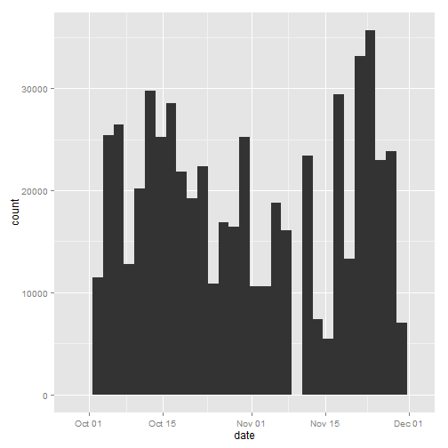
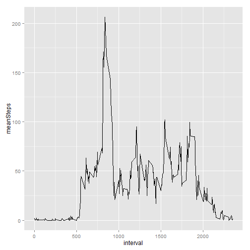
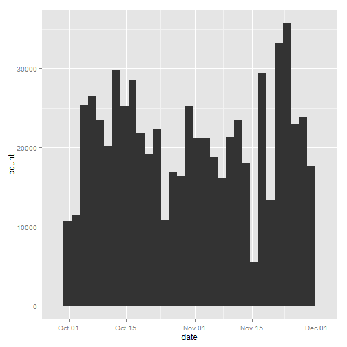
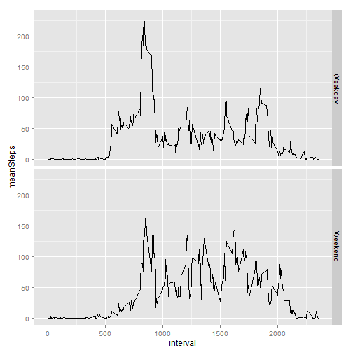

---
title: "Reproducible research project 1"
output: html_document
---

1. Loading required library


```r
library(dplyr)
library(ggplot2)
```


2. Loading dataset and preprocess data


```r
df <- read.csv("activity.csv")
df$date <- as.POSIXct(strptime(df$date, format = "%Y-%m-%d") )
```

3. What is mean total number, mean and median of steps taken per day?


```r
g1 <- ggplot(df, aes(x= date))
g1 + geom_histogram(aes(weight = steps))
```

 

```r
df1 <- df %>% filter(!is.na(steps)) %>% group_by(date) %>% summarise(totalSteps = sum(steps)) %>% 
      summarise(mean(totalSteps), median(totalSteps))
print(df1)
```

```
## Source: local data frame [1 x 2]
## 
##   mean(totalSteps) median(totalSteps)
## 1         10766.19              10765
```

4. What is the average daily activity pattern?


```r
df2 <- df %>% filter(!is.na(steps)) %>% group_by(interval) %>% summarise(meanSteps = mean(steps))
g2 <- ggplot(df2, aes(x = interval, y = meanSteps))
g2 + geom_line()
```

 

5. Imputing missing values


```r
df3 <- df
for (n in 1 : dim(df3)[1]) {
      if (is.na(df3$steps[n])) {
            df3$steps[n] <- floor(df2$meanSteps[which(df2$interval == df3$interval[n])])
      }
}
g3 <- ggplot(df3, aes(x = date))
g3 + geom_histogram(aes(weight = steps))
```

 

```r
df3s <- df3 %>% filter(!is.na(steps)) %>% group_by(date) %>% summarise(totalSteps = sum(steps)) %>% 
      summarise(mean(totalSteps), median(totalSteps))
print(df3s)
```

```
## Source: local data frame [1 x 2]
## 
##   mean(totalSteps) median(totalSteps)
## 1         10749.77              10641
```

6. Are there differences in activity patterns between weekdays and weekends?


```r
weekdays <- weekdays(df3$date)
weekdays <- gsub("Monday|Tuesday|Wednesday|Thursday|Friday", "Weekday", weekdays)
weekdays <- gsub("Saturday|Sunday", "Weekend", weekdays)
df4 <- cbind(df3, weekdays)
df4s <- df4 %>% group_by(weekdays, interval) %>% summarise(meanSteps = mean(steps))
g4 <- ggplot(df4s, aes(interval, meanSteps)) + geom_line()
g4 + facet_grid(weekdays ~ .)
```

 

